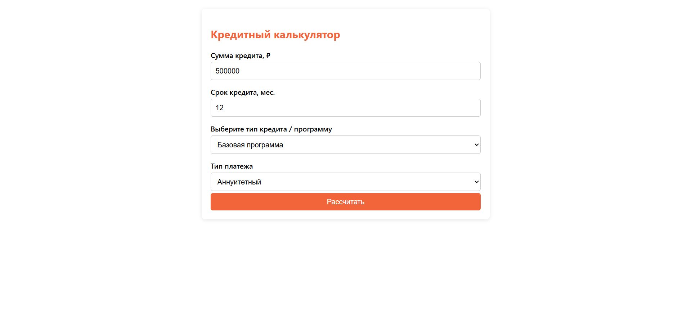
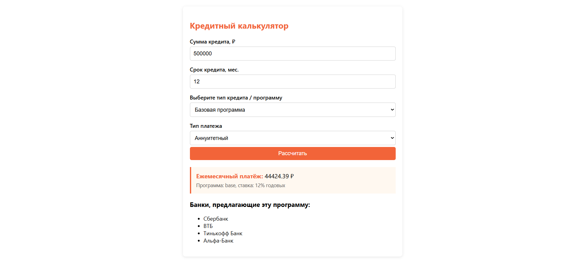

# Кредитный калькулятор

📌 Простой и удобный инструмент для расчёта ежемесячных платежей по кредиту: аннуитетный или дифференцированный.

---

## 🔧 Основные функции

- 📉 Выбор типа платежа: аннуитетный / дифференцированный  
- 💳 Возможность выбора программы кредита (с разными ставками)  
- 🏦 Отображение списка банков (пока статично, позже через API)  
- 🎨 Адаптирован под современные браузеры  
- 🌐 Поддержка внешних данных (заглушка под API)

---

## 🛠️ Стек

- HTML5
- CSS3
- JavaScript (ES6)
- Fetch API (заглушка)
- Локальный сервер (для тестирования)

---

## 🚀 Как запустить проект локально

1. Склонируйте репозиторий:
   git clone https://github.com/aleshaeslichto/msc-calculator.git

2. Перейдите в папку проекта:
   cd msc-calculator

3. Запустите локальный сервер:

   - Через VS Code: Установите расширение *Live Server*, кликните правой кнопкой на файле index.html → Open with Live Server.

4. Откройте в браузере страницу:
   http://localhost:8000

---

## 📸 Скриншоты

| Описание         | Скриншот              |
|------------------|------------------------|
| Главная страница |  |
| Результат расчёта|  |

---

## 🤝 Автор

Алексей Молчанов  
🔗 GitHub: [https://github.com/aleshaeslichto](https://github.com/aleshaeslichto)